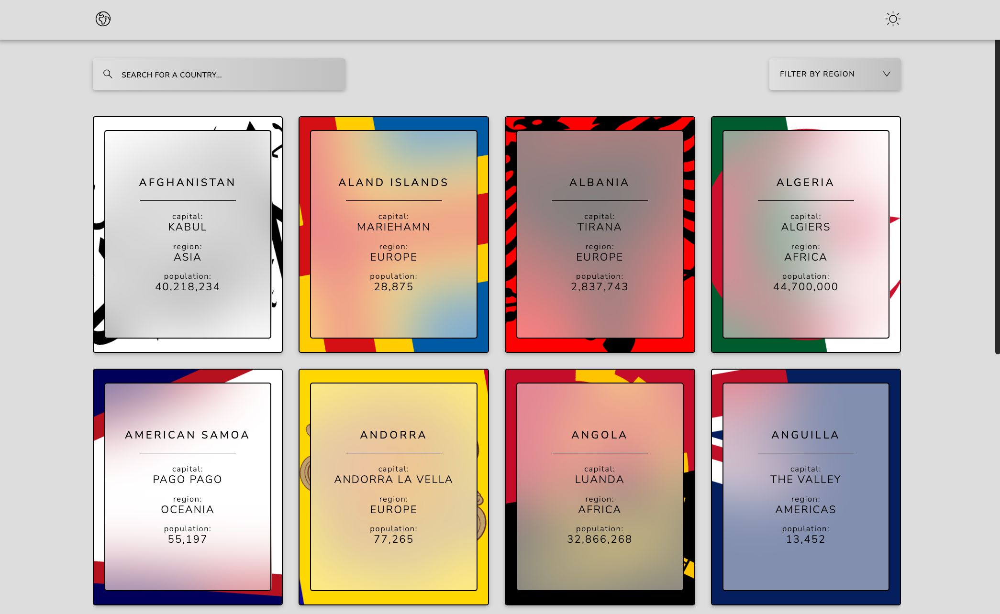

## Table of contents

- [Overview](#overview)
  - [The challenge](#the-challenge)
  - [Screenshot](#screenshot)
  - [Links](#links)
  - [Built with](#built-with)
  - [What I learned](#what-i-learned)
  - [Continued development](#continued-development)
  - [Useful resources](#useful-resources)
- [Author](#author)

## Overview

### The challenge

Users should be able to:

- See all countries from the API on the homepage - ✅
- Search for a country using an `input` field - ✅
- Filter countries by region - ✅
- Click on a country to see more detailed information on a separate page - ✅
- Click through to the border countries on the detail page - ✅
- Toggle the color scheme between light and dark mode _(optional)_ - ✅

### Screenshot

### Links

- [Live Site URL](https://ditwanp.github.io/AgeCalculatorFM/)
- [My FrontendMentor Solution](https://www.frontendmentor.io/solutions/react-typescript-tailwind-mocked-data-pagination-load-on-scroll-_2nrn9r-DM)

### Built with

- [Vite](https://vitejs.dev/) - Frontend project scaffolding.
- [React.js](https://reactjs.org/) - JavaScript library
- [TypeScript](https://www.typescriptlang.org/) - Typed JavaScript Superset
- [Tailwind CSS](https://tailwindcss.com/) - CSS framework

### What I learned

One of the most valuable lessons I gained from this project was understanding the concept of paginating data and implementing an infinite scroll behavior to load additional content. Upon examining the provided API for the project, I noticed its subpar performance. As a result, I opted to simulate data loading from an API by introducing a random timeout.

By simulating the request behavior, I successfully paginated the project's data and integrated infinite scroll functionality, which activates when users reach a predefined threshold.

In terms of styling, I chose a unique approach to this project, granting myself creative freedom and the opportunity to delve into more complex CSS techniques. This decision proved to be a great learning experience, as it allowed me to explore the trade-offs between aesthetics and performance, particularly when dealing with elements like blur, which can significantly impact a website's overall performance.

I also learned that designing is tricky and I'm not very good at it for now. 😄

### Continued development

I want to focus on optomizing my sites for a more speedy website. I want to find a good balance between visually pleasing and snappy. I also want to learn more about incorporating things like smooth scrolling and animations triggered by scroll.

### Useful resources

- [MDN](https://developer.mozilla.org/en-US/) - This is a given but most problems can usually be solved by reading the docs, extremely useful.
- [SVG Repo](https://www.svgrepo.com/) - I used this site to source my svg icons.

## Author

- Website - [Ditwan Price](https://www.your-site.com)
- Frontend Mentor - [@DitwanP](https://www.frontendmentor.io/profile/DitwanP)
